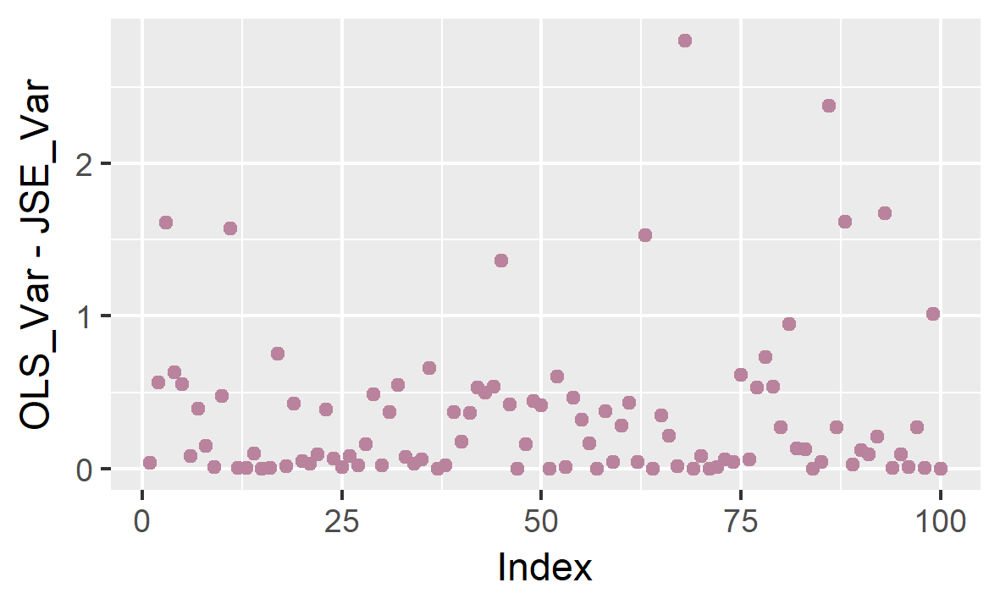

# Summary

This folder contains simulations for measuring the variance of fold change estimates.
We compare the James-Stein estimators to the ordinary least squares estimators for the differential gene expression model described in the `sleuth` paper.

## Results

All measured variances to the JS estimator are smaller than the OLS estimator in these simulations.

## Conclusions

The statistical model used by `sleuth`, with theoretical data, shows that the JS estimators not only are unbiased, but also have smaller variances than the OLS estimators.
We should try similar simulations with real RNA-seq data.
