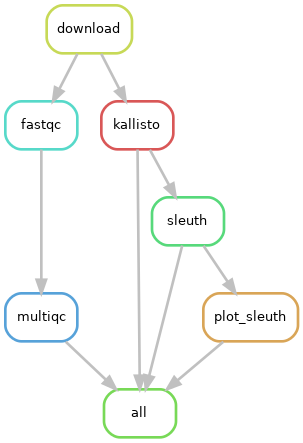
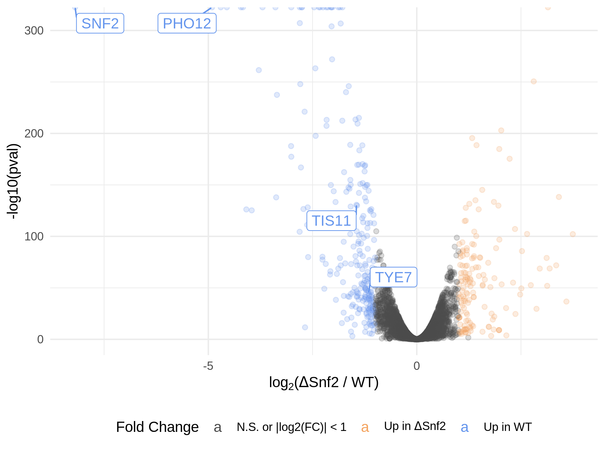
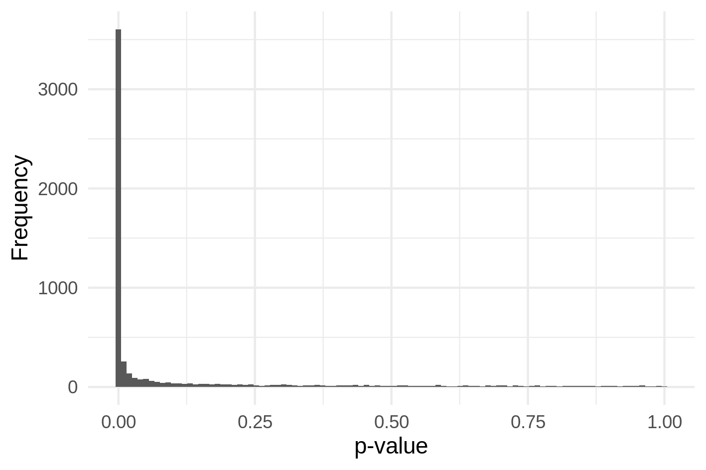

# Gierlinski _et al._, Bioinformatics, 2015

This folder contains data and differential gene expression from [Gierlinski _et al._, Bioinformatics, 2015](https://doi.org/10.1093/bioinformatics/btv425).
In this folder, we download the data, preprocess it, and perform differential gene expression analysis.
This serves as the gold standard for a differential expression experiment.

## Materials

This RNA-seq data is obtained from two conditions, wild type _Saccharomyces cerevisiae_ and an _snf2_ knock-out mutant cell line.
The samples are described as follows:

> A controlled, 48 biological replicate, RNA-seq experiment in the model organism _Saccharomyces cerevisiae_ was performed for wild type (WT) and a snf2 knock-out mutant cell line (Δsnf2).
> Briefly, the extracted total RNA from each of the 96 replicates was enriched for polyadenylated RNA, quality checked, and had an appropriate amount of artificial External RNA Controls Consortium (ERCC) spike-in transcripts added (Jiang et al., 2011, Loven et al., 2012) before undergoing the standard Illumina multiplexed TruSeq library preparation.
> The libraries were pooled and sequenced on seven lanes of a single flow-cell on an Illumina HiSeq 2000 using a balanced block design (Auer and Doerge, 2010), resulting in a total of ∼1 billion 50-bp single-end reads across the 96 samples.

Quality control metrics for the data can be found in the [MultiQC report](Reports/multiqc_report.html).

## Methods

We quantify the RNA with [Kallisto](https://doi.org/10.1038/nbt.3519) (v0.46.2) with the [_S. cerevisiae_ transcriptome](https://github.com/pachterlab/kallisto-transcriptome-indices/releases/tag/ensembl-96) (Ensembl v96).

After quantification, we perform differential gene expression analysis between the mutated and wild type samples with the [Sleuth model](https://doi.org/10.1038/nmeth.4324) (v0.30.0).
Hypothesis test p-values were adjusted for multiple testing with the FDR method.
Significance was determined at a q-value threshold of 0.01, and we consider differentially expressed genes with a large mangitude of change, at least 2 fold in either direction.

The workflow of this analysis is as follows:

## Results

### RNA-seq data quality control

The RNA-seq data is generally of good quality.
The base call mean quality scores are almost all > Phred 30, with the per base sequence content failing because of the first 6 bases on each read.
This is likely due to fragmentation, and not another issue in the data.

There appears to be an issue with Lane 4, since the per base N content is high for all samples in that lane.
But, again, this doesn't appear to be a major issue overall.

More than 60% of reads were pseudo-aligned across all samples, resulting in > 6 M reads per sample, on average.
Overall, the RNA-seq data appears to be of good quality with sufficient depth.

### Differential expression

3652 genes are differentially expressed between the mutant and wild type, but only 398 of them have a large change of at least 2 fold.

Given the large number of replicates, the p-value histogram is very clear in the enrichment of small p-values.

## Conculsions

This experiment is more powerful than realistic experiments in molecular biology papers, but the analysis appears very robust.
This is a good benchmark of differentially expressed genes to compare against.
